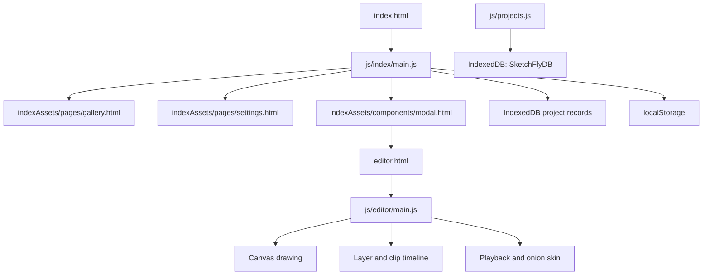

# SketchFly

SketchFly is a browser-based 2D animation workspace. It is designed to let users create frame-based drawings, arrange them across layers, preview the animation, and manage project preferences from a lightweight interface.

## Purpose

The project is a frontend prototype for an animation studio. Its main goals are to provide:

- A home screen for navigating the app.
- A project creation form with a project name, canvas size, and FPS value.
- A canvas editor with pencil and eraser tools.
- A layer-based timeline made from individual animation clips.
- Playback, frame navigation, onion-skin previews, undo/redo, and clip editing.
- A gallery of example projects and a theme setting.

## Current Status

The app is currently a static browser application with no build step or backend. Projects and exports are stored in IndexedDB for the current browser profile.

- New projects are created from the modal and opened as `editor.html?id=<project-id>`.
- The editor loads the selected project's settings, layers, clips, and frame images.
- Changes autosave after drawing and timeline edits. `Ctrl+S` also saves immediately.
- The gallery reads project metadata and first-frame thumbnails from IndexedDB.
- Starred projects appear first; all other projects are ordered newest to oldest.
- Gallery cards support star, edit settings, and delete actions through the overflow menu.
- The editor accepts PNG, JPG, MP4, and MP3 files as timeline clips. Image clips render on the canvas, while imported media is preserved with clip metadata.
- Assets can be added with the **Import assets** button in the editor or by dragging files onto the canvas area.
- Video exports appear in Exports and can be downloaded. The browser's supported `MediaRecorder` format is used, so some browsers produce WebM instead of MP4.
- Theme selection is stored in `localStorage` under `theme`.
- `data/projects.json` remains as sample metadata, but it is not the live gallery source.

## How To Run

Because the app uses JavaScript modules and `fetch()` to load HTML fragments, run it through a local web server. Opening `index.html` directly with a `file://` URL may prevent these requests from working.

### Option 1: Python

From the project folder:

```powershell
py -m http.server 8000
```

Then open [http://localhost:8000](http://localhost:8000) in a browser.

### Option 2: VS Code Live Server

Install the Live Server extension, right-click `index.html`, and choose **Open with Live Server**.

The app has no `package.json`, so `npm install` and a frontend build command are not required at this stage.

## How The App Is Connected



### Home page

1. `index.html` provides the navigation, landing section, and empty content container.
2. `js/index/main.js` listens for navigation clicks.
3. The selected page fragment is fetched from `indexAssets/pages/` and inserted into `#content-container`.
4. Gallery data is read from IndexedDB; `projectCard.html` is used as the card template. Starred status and creation time determine ordering.
5. The Animate button fetches `modal.html`, creates and saves a project, and redirects to `editor.html?id=<project-id>`.

### Editor

`editor.html` defines the editor layout: toolbar, canvas, timeline, playback controls, and clip controls. `js/editor/main.js` then:

- Creates the canvas and animation timeline.
- Stores drawing frames as `Clip` objects inside layer arrays.
- Renders the active frame and previews into canvas elements.
- Handles pencil, eraser, color, zoom, pan, playback, onion skin, and keyboard shortcuts.
- Maintains undo and redo stacks per clip, limited by `MAX_UNDO`.

The editor initializes a blank clip only when the selected project has no clips.

Use **Import assets** to choose one or more PNG, JPG, MP4, or MP3 files. You can also drag supported files directly onto the canvas area. Imported items are added to the timeline as clips; image files are drawn into the canvas, and audio/video files retain their media Blob for future playback support.

### Data storage

There are two storage paths at the moment:

- `localStorage`: small browser preferences and the latest project-creation form values.
- IndexedDB: the storage for complete projects, exposed through `js/projects.js` with `createProject`, `saveProject`, `loadProject`, `getAllProjects`, and `deleteProject`.
- IndexedDB also contains an `exports` store for generated video blobs.

Keep large canvas or frame data out of `localStorage`; use IndexedDB or another database instead.

## Project Structure

```text
index.html                       Home page shell
editor.html                      Animation editor shell
data/projects.json               Example gallery project metadata
indexAssets/components/          Reusable modal and card markup
indexAssets/pages/               HTML fragments loaded into the home page
js/index/main.js                 Home navigation, fragments, gallery, settings
js/editor/main.js                Canvas, tools, timeline, playback, interactions
js/projects.js                   IndexedDB project data layer and image helpers
style/style.css                  Home page styles
style/editor.css                 Editor styles
style/**/*.scss                  Source SCSS files for styling work
indexAssets/images/              Logos and image assets
```

## Making Future Updates

### Add a home page section

1. Add a fragment such as `indexAssets/pages/help.html`.
2. Add a navigation button in `index.html` with `data-section="help"`.
3. Add any section-specific event handlers in `js/index/main.js`.
4. Add styles in the appropriate home page stylesheet.

`loadFragment()` automatically maps the `data-section` value to `indexAssets/pages/<section>.html`.

### Add a gallery project

Create projects through the modal. For seeded or imported projects, save records with `createProject()` and `saveProject()` so the gallery can read their metadata and thumbnail.

Gallery overflow actions update project name and star state in IndexedDB. The editor's Project Settings button updates the same record.

### Connect project persistence

The recommended flow is:

1. Create a project with `createProject()` when the modal is submitted.
2. Save it with `saveProject()` and pass its ID to the editor, for example `editor.html?id=<project-id>`.
3. In `js/editor/main.js`, load the project on startup with `loadProject(projectId)`.
4. Convert stored frame image buffers back into canvases with `bufferToCanvas()`.
5. Save after meaningful edits such as drawing, clip changes, layer changes, and project settings changes.
6. Use `getAllProjects()` for gallery metadata and the stored `thumbnail` buffer for the first-frame preview.

### Add editor icons

Place SVG files in `editorAssets/icons/` using the names referenced by `editor.html`, including `pencil.svg`, `eraser.svg`, `home.svg`, `settings.svg`, `undo.svg`, `redo.svg`, `cut.svg`, `copy.svg`, `paste.svg`, `delete.svg`, and `onion.svg`.

### Localization

The Settings fragment creates language names with `Intl.DisplayNames`. Choosing a language calls the LibreTranslate-compatible API from `js/index/main.js` to translate page text. The `.logo` element is excluded so the SketchFly brand remains unchanged. Network access is required, and a self-hosted or authenticated endpoint is recommended for production.

When changing the project schema, increment `DB_VERSION` and add a migration in `openDB()`.

### Update editor behavior

Keep editor state changes inside `js/editor/main.js` and reuse the existing `Clip` and layer model. When adding a new tool, update the toolbar markup in `editor.html`, register its event handlers, and include its rendering behavior in both the pointer handlers and `render()` where appropriate.

## Troubleshooting

- **Fragments do not load:** use a local web server instead of opening the HTML file directly. the js files that are using Fetch() from other js files which will not run without a server the contents need to load via fetch().
- **The gallery is empty:** create a project first, then check that browser storage is enabled and the server is started from the project root.
- **Changes appear to be missing:** clear the browser's site data if old `localStorage` or IndexedDB values are affecting the result.
- **Editor project data does not persist:** confirm the page is running from a local server and that browser storage is enabled for the site.
- **Exports are WebM instead of MP4:** MP4 recording depends on browser codec support; the app chooses the best supported `MediaRecorder` MIME type.
- **Icons are missing:** add the SVG assets to `editorAssets/icons/` using the filenames referenced by `editor.html`.
