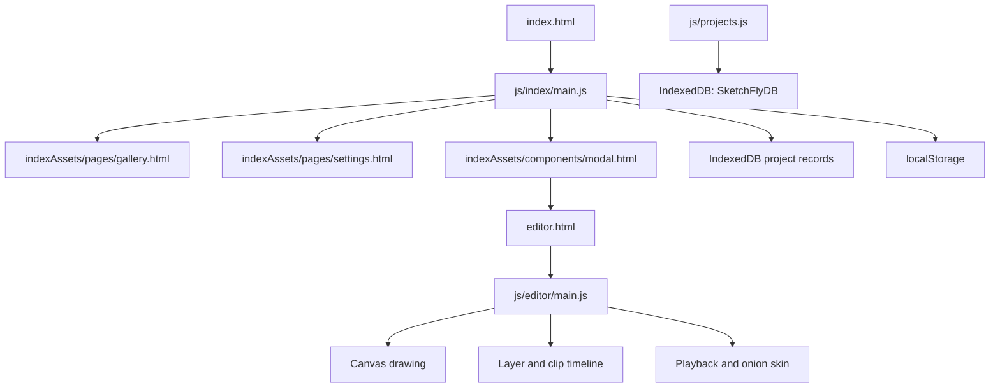

# SketchFly

SketchFly is a browser-based 2D animation workspace. It is designed to let users create frame-based drawings, arrange them across layers, preview the animation, and manage project preferences from a lightweight interface.

## How To Run

Because the app uses JavaScript modules and `fetch()` to load HTML fragments, run it through a local web server. Opening `index.html` directly with a `file://` URL may prevent these requests from working.

### Option 1: GitHub Pages

Link: https://noorzahra12.github.io/SketchFly/

### Option 2: VS Code Live Server

Install the Live Server extension, right-click `index.html`, and choose **Open with Live Server**.
The app has no `package.json`, so `npm install` and a frontend build command are not required at this stage.

### Option 3: Python

From the project folder:

```powershell
py -m http.server 8000
```

Then open [http://localhost:8000](http://localhost:8000) in a browser.

## How The App Is Connected



### Home page

1. `index.html` provides the navigation, landing section, and empty content container.
2. `js/index/main.js` listens for navigation clicks.
3. The selected page fragment is fetched from `indexAssets/pages/` and inserted into `#content-container`.
4. Gallery data is read from IndexedDB; `projectCard.html` is used as the card template. Starred status and creation time determine ordering.
5. The Animate button fetches `modal.html`, creates and saves a project, and redirects to `editor.html?id=<project-id>`.

### Editor

`editor.html` defines the editor layout: toolbar, canvas, timeline, playback controls, and clip controls. `js/editor/main.js` then:

- Creates the canvas and animation timeline.
- Stores drawing frames as `Clip` objects inside layer arrays.
- Renders the active frame and previews into canvas elements.
- Handles pencil, eraser, colour, zoom, pan, playback, onion skin, and keyboard shortcuts.
- Maintains undo and redo stacks per clip, limited by `MAX_UNDO`.

The editor initialises a blank clip only when the selected project has no clips.

Use **Import assets** to choose one or more PNG, JPG, MP4, or MP3 files. You can also drag supported files directly onto the canvas area. Imported items are added to the timeline as clips; image files are drawn into the canvas, and audio/video files retain their media Blob for future playback support.

### Data storage

There are two storage paths at the moment:

- `localStorage`: small browser preferences and the latest project-creation form values.
- IndexedDB: the storage for complete projects, exposed through `js/projects.js` with `createProject`, `saveProject`, `loadProject`, `getAllProjects`, and `deleteProject`.
- IndexedDB also contains an `exports` store for generated video blobs.

Keep large canvas or frame data out of `localStorage`; use IndexedDB or another database instead.

## Project Structure

```text
index.html                       Home page shell
editor.html                      Animation editor shell
data/projects.json               Example gallery project metadata
indexAssets/components/          Reusable modal and card markup
indexAssets/pages/               HTML fragments loaded into the home page
js/index/main.js                 Home navigation, fragments, gallery, settings
js/editor/main.js                Canvas, tools, timeline, playback, interactions
js/projects.js                   IndexedDB project data layer and image helpers
style/style.css                  Home page styles
style/editor.css                 Editor styles
style/**/*.scss                  Source SCSS files for styling work
indexAssets/images/              Logos and image assets
```